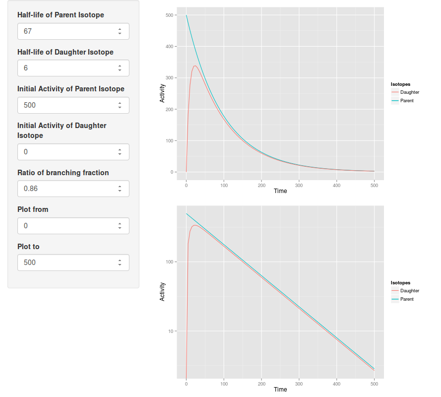
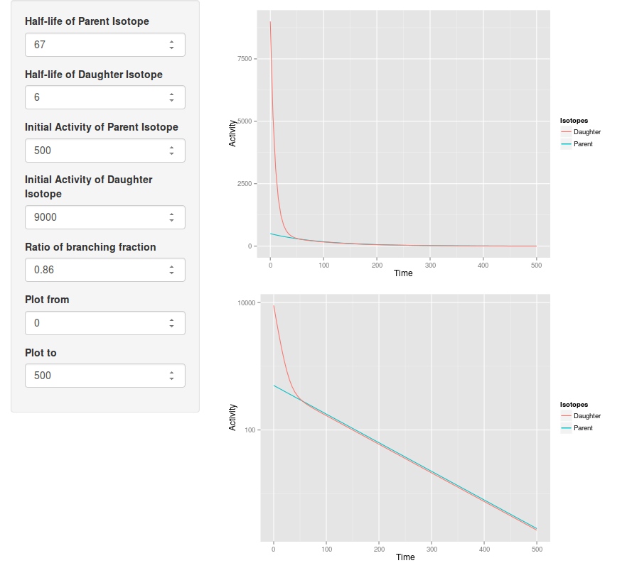
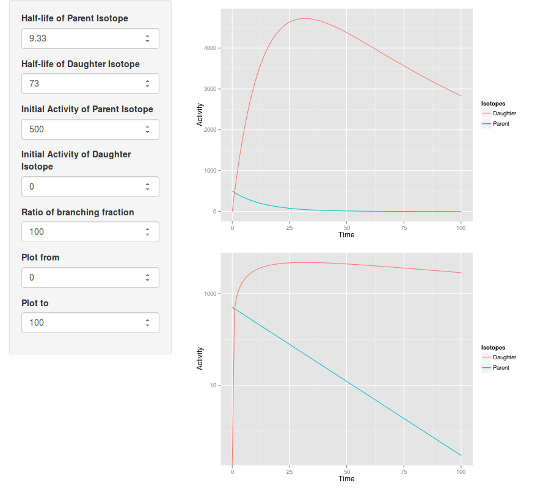

#isotopeEQ

##這是啥？

某些醫用放射性同位素是屬於某個 decay chain 的一部分。例如以 Mo-99/Tc-99m 孳生器為代表的一群[孳生器](http://www.nucmedtutorials.com/dwradiopharm/rad7.html)，或是以間接法製備的 [Tl-201](http://www.med.harvard.edu/jpnm/physics/isotopes/Tl/Tl201/prod.html)。為了解釋為什麼在這個時間點是最合適的時間往往費盡力氣計算，或是上窮璧落下黃泉找別人的圖，不如就寫個小工具來產生吧！

##授權

WTFPL

##Screenshot

預設畫面。這是一個剛 elute 的 Mo-99/Tc-99m 孳生器。

所謂的平衡就是即使你做了破壞平衡的設定，只要時間夠久，平衡就會出現。

除了孳生器，你也可以試試透過間接法產生的 Tl-201。

##Powered by

1. [R](http://www.r-project.org)

2. [Shiny](http://www.rstudio.com/shiny/)

3. [ggplot2](http://ggplot2.org)

##操作變數們

###時間

下列數值和時間有關係，請全部用同一個單位： (秒或分或小時或年你決定就好)

* Half-life of Parent Isotope: 母核半衰期

* Half-life of Daughter Isotope: 子核半衰期

* Plot from/Plot tw：繪圖開始及結束的時間點

###活度
下列數值和活度有關係，請全部用同一個單位：

* Initial Activity of Parent Isotope：母核起始活度

* Initial Activity of Daughter Isotope：子核起始活度

###其他

* Ratio of branching fraction：有些母核不只衰變為一個子核，請填入待測子核所佔的比例。
